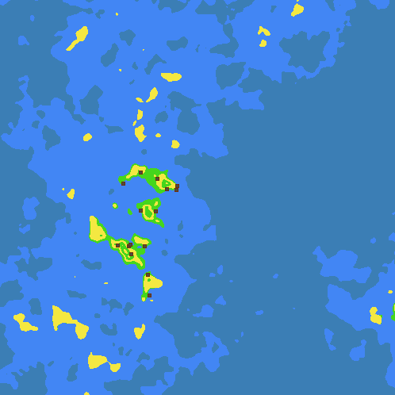
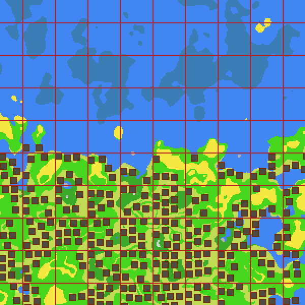

# betterterrain.js
The better terrain algorithm for javascript. What's the perk? The terrain generates infinitely, yet it is just as detailed as terrain made with midpoint displacement! In addition, it also generates structures, like houses!
Uses [@jwagner simplex-noise.js](https://github.com/josephg/noisejs) which is itself based upon Stefan Gustavson's implementation. (Note: uses typed arrays)




## API

```javascript
var terrain = new betterterrain(options);
```
Create a `betterterrain` instance.

### Options

#### Frequency

```javascript
options.freq = 50;
```
Change frequency of Simplex Noise, (aka. zoom in and out).

#### Chunk size

```javascript
options.chunksize = 64;
```
Change chunksize. Chunksize is used to generate structures, so the size of the chunksize should be the size of your largest structure. The larger the chunksize, the longer it takes to generate small areas, the smaller the chunksize, the faster it takes to generate but bigger buildings might not generate. It is up to you to decide upon what you want.

#### Biomes

```javascript
options.biomes = {
	W: {
    	name: "water",
        color: "#4286f4"
    },
    D: {
        name: "desert",
        color: "#f4e841"
    },
    P: {
        name: "plains",
        color: "#c2db55",
        structures: [{
        	name: "house",
            chance: 50
        }]
    },
    J: {
        name: "jungle",
        color: "#45d61d",
        childtiles: [{
        	name: "P",
            chance: 20
        }]
    }
};
```
Biomes to be used in generation. `Name` and `color` in this example are unneccessary, they are only used for show. `structures` is used to generate structures if you are using them. `childtiles` is used for replacing `chance` percent of tiles of that biome at generation with another. For example, in this case, 20% of jungle tiles will be replaced with `P` (plains) tiles. The biomes object can be removed entirely if all you are using is a `biomemap`. All biome tiles without a `childtiles` or `structures` property are unneccesary. This means both `W` (water) and `D` (desert) can be excluded in this example.

#### Seed

```javascript
options.seed = 123456789;
```
The seed of the terrain.

#### Only height

```javascript
options.onlyheight = false;
```
Determines whether biomes will be generated as well. This options only produces a heightmap, not biomes. Only use this option if you are generating your own biomes or you don't have need for biomes.

#### Biome map

```javascript
options.biomemap = [
            ["S", "S", "S", "S", "I", "I"], // <--- 1
            ["S", "S", "S", "I", "I", "B"],
            ["S", "S", "I", "I", "B", "B"],
            ["S", "S", "I", "I", "B", "P"],
            ["S", "B", "B", "B", "P", "J"],
            ["S", "B", "B", "B", "P", "J"],
            ["S", "F", "F", "P", "J", "D"],
            ["S", "F", "P", "J", "D", "D"],
            ["I", "W", "W", "W", "W", "W"], // <--- 0
            ["X", "X", "X", "X", "X", "X"],
            ["X", "X", "X", "X", "X", "X"],
            ["X", "X", "X", "X", "X", "X"],
            ["X", "X", "X", "X", "X", "X"],
            ["X", "X", "X", "X", "X", "X"],
            ["X", "X", "X", "X", "X", "X"],
            ["X", "X", "X", "X", "X", "X"],
            ["X", "X", "X", "X", "X", "X"],
            ["X", "X", "X", "X", "X", "X"]  // <--- -1
        ];
```
This determines the creation of biomes. The `x` axis is moisture, the `y` axis is height. Notice these letters correspond to the `biomes` properties above. When these biomes are generated, the terrain generator will check to see if the item is available in the biomes option. If it is, then the events explained above will occur for that tile. If it is not, then nothing will happen.

#### Structures

```javascript
options.structures = {
    house: {
        data: function(environmentdata) {
            var data = [
                ["F", "F", "F", "F", "F", "F", "F"],
                ["F", "G", "G", "G", "G", "G", "F"],
                ["F", "G", "G", "G", "G", "G", "F"],
                ["F", "G", "G", "G", "G", "G", "F"],
                ["F", "G", "G", "G", "G", "G", "F"],
                ["F", "G", "G", "G", "G", "G", "F"],
                ["F", "F", "F", "F", "F", "F", "F"]
            ];
            return data;
        },
        requireddistance: 2,
        allowedoverlap: false
    }
}
```

The structures to be passed and generated. The name of the structure is the first property. `data` is the function to be called when the structure will be generated. It can either be a function or an array. `requireddistance` is the required distance from another structure must be (in units). `allowedoverlap` defines whether the structure can overlap on top of other structures. `requireddistance` is only called when this option is `false`. The array of arrays the function produces is the shape of the structure. The elements of the array are the names of the items. If the structure is not a rectangle, just set the unused values of the structure to `undefined`, `false`, `0`, or `null`. The shape of the `data` must always be a rectangular array of arrays.

### Methods

#### Getdata

```javascript
var terrain = new betterterrain();
var x = 3; // anything you want
var y = 6; // anything you want
console.log(terrain.getdata(x, y));
/*
{
    h: 0.45638263857,       // height
    m: -0.2648298765,       // moisture
    b: "J",		    // biome name
    i: "F",	       	    // name of item produced by structure, if applicable
    s: "house"		    // name of structure returned, if applicable
}
*/
```
This method returns a object of data created by the terrain generator.

#### Note
there are no plans to include erosion in this library because it would make it __way too slow!__ If you really want this feature added, start a pull request and I'll try it!
